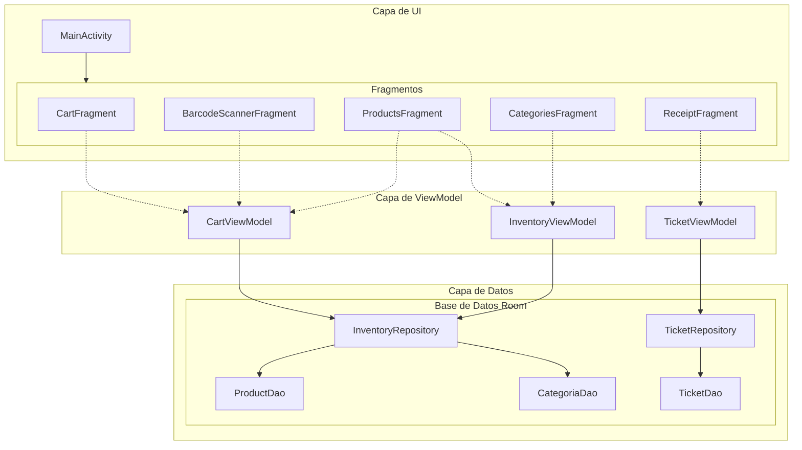

# Arquitectura de POSLite

Este documento describe la arquitectura de alto nivel de POSLite. Está diseñado para ayudar a los colaboradores a entender cómo está estructurada la aplicación y cómo fluyen los datos entre los componentes.

## Resumen

POSLite sigue el patrón arquitectónico **MVVM (Model-View-ViewModel)**, recomendado por Google para el desarrollo moderno de Android. Esto asegura una clara separación de responsabilidades:

- **View (Vista)**: Fragmentos y Activities que muestran datos y capturan acciones del usuario.
- **ViewModel**: Mantiene el estado de la UI y la lógica de negocio, sobreviviendo a cambios de configuración.
- **Model (Repositorio y Fuente de Datos)**: Gestiona operaciones de datos (Base de datos Room).

## Diagrama de Arquitectura

## Componentes Clave

### 1. Capa de UI (Vistas)
- **MainActivity**: El contenedor de actividad único. Maneja la lógica de navegación, especialmente el comportamiento responsivo entre modos Teléfono (BottomNav) y Tablet (Barra Lateral).
- **Fragmentos**:
  - `CartFragment`: Muestra la venta actual, maneja eliminación de items y actualización de cantidades.
  - `BarcodeScannerFragment`: Usa CameraX y ML Kit para escanear códigos de barras.
  - `ProductsFragment`: Lista productos, permite adición manual al carrito.
  - `CategoriesFragment`: Vista de cuadrícula de categorías.
  - `ReceiptFragment`: Historial de ventas pasadas.

### 2. Gestión de Estado (ViewModels)
- **CartViewModel**: Un `SharedViewModel` con alcance a la Activity. Esto es crítico porque el estado del Carrito debe persistir mientras el usuario navega entre Escáner, Productos y Categorías.
- **InventoryViewModel**: Gestiona la obtención y filtrado de productos y categorías.
- **TicketViewModel**: Maneja la carga del historial de ventas y el guardado de nuevos tickets.

### 3. Capa de Datos (Repositorios y Room)
- **Repositorios**: Abstraen la fuente de datos. Actualmente, solo tenemos una base de datos local, pero este patrón permite agregar una API remota en el futuro sin cambiar los ViewModels.
- **Base de Datos Room**:
  - `AppDatabase`: La clase de base de datos abstracta.
  - `DAOs`: Objetos de Acceso a Datos que definen consultas SQL.
  - `Entidades`: Clases de datos que representan tablas de la base de datos.

## Ejemplo de Flujo de Datos: Escaneando un Producto

1. **Usuario** apunta la cámara a un código de barras en `BarcodeScannerFragment`.
2. **ML Kit** detecta el código y retorna el valor crudo (SKU).
3. `BarcodeScannerFragment` llama a `CartViewModel.addItem(sku)`.
4. `CartViewModel` solicita detalles del producto a `InventoryRepository`.
5. `InventoryRepository` consulta `ProductDao` por el SKU.
6. **Base de Datos** retorna la `ProductEntity`.
7. `CartViewModel` actualiza su StateFlow `_cartItems`.
8. **UI** (CartFragment y FAB) observa el cambio de estado y actualiza el precio total y conteo de items.

## Diseño Tablet vs Teléfono

POSLite usa una estrategia de diseño responsivo:

- **Teléfono**: Usa un `BottomNavigationView` y un `FloatingActionButton` dinámico que cambia de función basado en la pantalla (Escáner vs Ir al Carrito).
- **Tablet**: Usa un enfoque de Vista Dividida.
  - **Izquierda**: Navegación lateral (Categorías, Recibos).
  - **Centro**: Contenido principal (Cuadrícula de Productos).
  - **Derecha**: `CartFragment` persistente que siempre es visible.

Esto se gestiona en `MainActivity` verificando el recurso booleano `is_tablet`.
