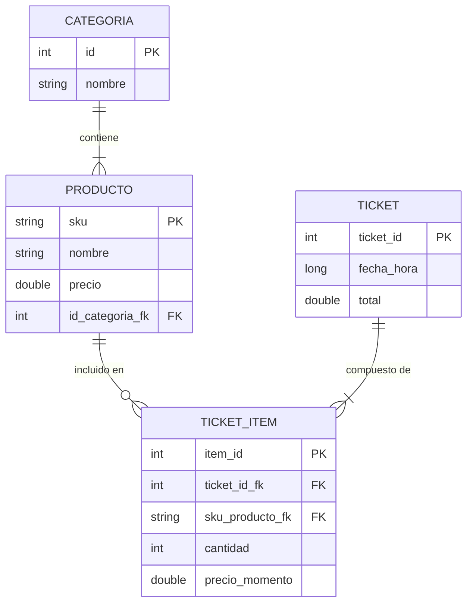

# Esquema de Base de Datos

POSLite utiliza **Room** (una abstracción sobre SQLite) para la persistencia local de datos. La base de datos está normalizada para asegurar la integridad de los datos.

## Diagrama Entidad-Relación (ERD)

## Detalle de Tablas

### 1. `Producto`
Almacena los artículos del inventario.

| Columna | Tipo | Descripción |
|:-------|:-----|:------------|
| `sku` | String | **PK**. Valor del código de barras. Identificador único. |
| `nombre` | String | Nombre del producto (ej. "Coca-Cola 600ml"). |
| `precio` | Double | Precio de venta actual. |
| `id_categoria_fk` | Int | **FK**. Referencia a `Categoria.id`. |

### 2. `Categoria`
Agrupa productos para una navegación más fácil.

| Columna | Tipo | Descripción |
|:-------|:-----|:------------|
| `id` | Int | **PK**. ID autogenerado. |
| `nombre` | String | Nombre de la categoría (ej. "Bebidas", "Botanas"). |

### 3. `Ticket`
Representa el encabezado de una transacción completada.

| Columna | Tipo | Descripción |
|:-------|:-----|:------------|
| `ticket_id` | Int | **PK**. ID autogenerado. |
| `fecha_hora` | Long | Timestamp Unix de la venta. |
| `total` | Double | Monto total final de la venta. |

### 4. `TicketItem` (Detalles de Venta)
Vincula productos a un ticket, preservando el precio al momento de la venta.

| Columna | Tipo | Descripción |
|:-------|:-----|:------------|
| `item_id` | Int | **PK**. ID autogenerado. |
| `ticket_id_fk` | Int | **FK**. Referencia a `Ticket.ticket_id`. |
| `sku_producto_fk` | String | **FK**. Referencia a `Producto.sku`. |
| `cantidad` | Int | Cantidad vendida. |
| `precio_momento` | Double | Precio del artículo **al momento de la venta**. Esto asegura precisión histórica incluso si los precios cambian después. |

## Objetos de Acceso a Datos (DAOs)

- **ProductDao**: Maneja CRUD para productos y búsqueda por SKU o Categoría.
- **CategoriaDao**: Maneja CRUD para categorías.
- **TicketDao**: Maneja el guardado de tickets y recuperación del historial de ventas. Típicamente usa una `@Transaction` para guardar el Ticket y todos sus TicketItems atómicamente.